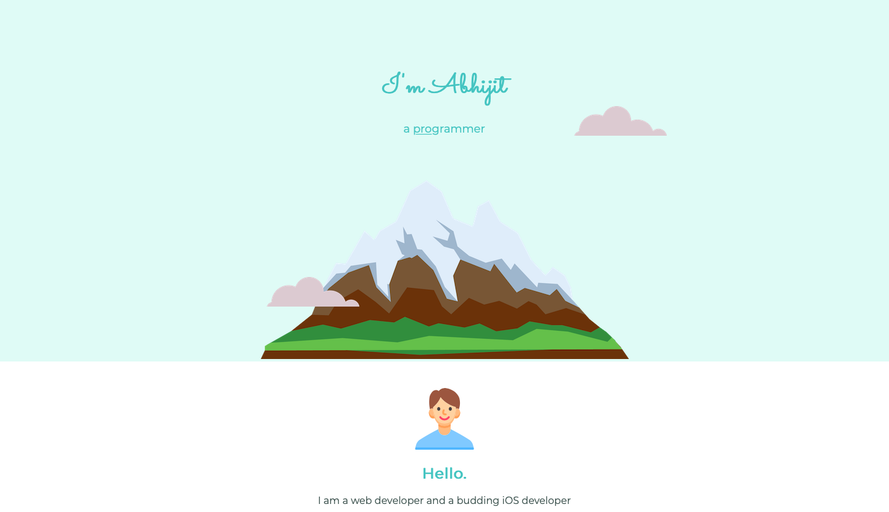
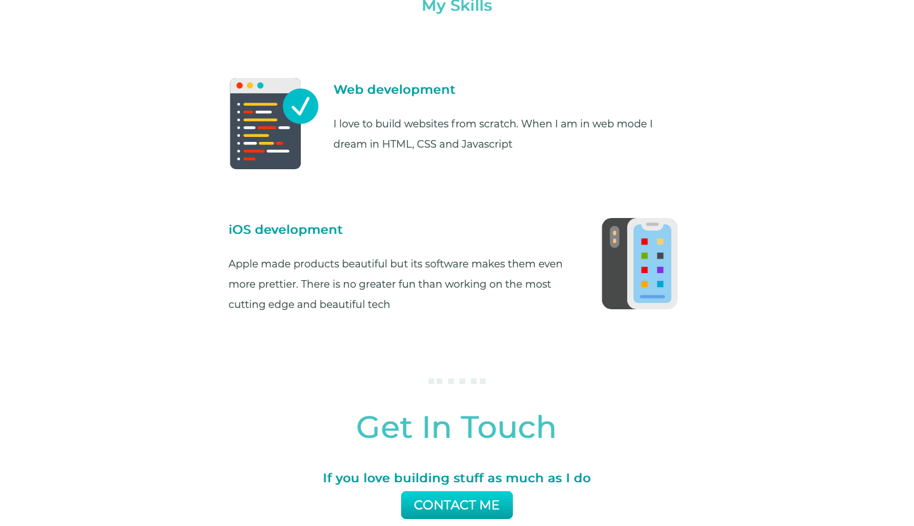

# Retro-Porfolio-Recreation

This project is a recreation of Sean Halpin's old website using HTML and CSS, without any use of JavaScript. The purpose of this project is to showcase the web design skills of the developer and provide a way for people to view Sean Halpin's old website as it looked like in the past.

## Project Description

The original website was designed and developed by Sean Halpin, an award-winning web designer, in the early 2000s. The website was known for its unique and creative design elements, such as hand-drawn illustrations and colorful backgrounds.

This recreation project aims to replicate the design and layout of the original website as closely as possible, while using modern HTML and CSS techniques to make it responsive and accessible on different devices and screen sizes.

## Screenshots

